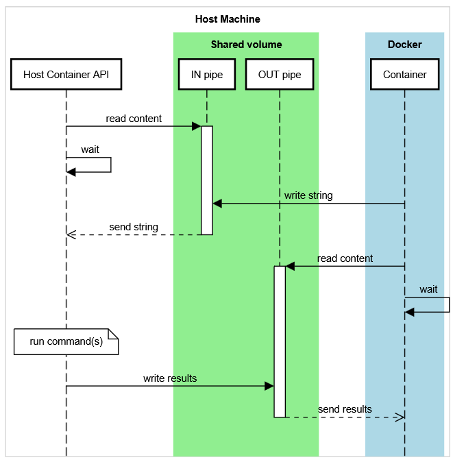

# Host Container API

This project reads strings from a named pipe, runs a command and writes the output
to another named pipe. Intended to be used with a Docker service that requires
data from the host machine (for home servers). This executes on the host machine,
not a Docker container.

Linux only. Use at your own risk.



# Data format contract

## Request

This program expects content written to the named pipe to follow this format:

```txt
<pipe-name>:<command-name>
```

pipe-name
: Where the response should be sent. Can be a fixed or random value.

command-name
: Indicates which **command** should run. A command (in this context)
is a class extending `AbstractCommand` that has a `name`
property that has to be used to execute said class.

## Response

After executing a command, the output will follow this JSON format:

```json
{
  "success": bool,
  "message": string,
  "data": object
}
```

success
: true or false

message
: empty if `success` is true, else will contain some description

data
: the command output

# How to add custom commands

Create a python class extending the `AbstractCommand` class and place it 
inside the `commands` folder. The program will automatically read it from there. 

```python
from lib.AbstractCommand import AbstractCommand


class CustomCommand(AbstractCommand):
    name = "custom-command"
```
