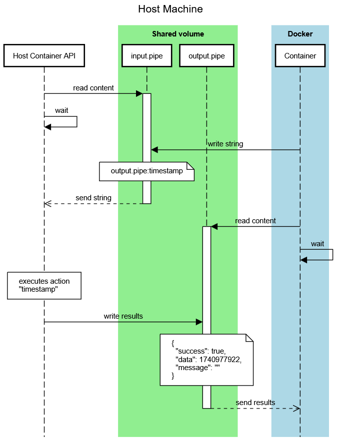

[](https://github.com/eliasdorigoni/host-container-api/actions/workflows/python-app.yml)

# Host Container API

Run programs from requests received via named pipes.

Intended to be used in home servers requiring information like system temperature, 
free disk space, ram usage, etc, from a Docker container. Do not use in production.

- ✅ Works on Linux. Tested on Ubuntu and MacOS.
- ❌ Does not work on Windows since that requires lots of OS-specific code.

# How does this work

This app is continuously listening on an incoming [named pipe](https://en.wikipedia.org/wiki/Named_pipe). 
When certain keywords are received, the app executes actions (which are custom classes)
and sends the output to an outgoing named pipe in JSON format.



# Installation

```shell
# Clone this repo and cd into it
git clone this-repo
cd this-repo

# Create a virtual environment
python3 -m venv venv

# Activate the virtual env
source venv/bin/activate

# Install required packages in virtual env
pip install -r requirements.txt

# Duplicate the config and customize to your needs
cp example.config.yaml config.yaml
```

# Execution

```shell
source venv/bin/activate
python . listen
```

You can also use `python . -h` to see help.

*TODO: add a script to ensure constant execution*

# Pipe content format

To make things clear, a **request** happens when an external program writes in the input
pipe, and a **response** is when this app writes to the output pipe.


## Requests
For **requests**, all programs must write to the pipe defined in 
`input_pipe_filename` in the configuration file, according to this format:

```txt
<pipe-name>:<action-name>
```

**pipe-name**
: Where the response should be sent. Will be created if it does not exist.

**action-name**
: What **action** should run. An action is a special class that can execute code
and returns data.

## Responses

All **responses** are written to the file specified in the `pipe-name`
part of the request. The content will be a JSON-formatted object with 3 root 
items:

```text
{
  "success": bool
  "message": string
  "data": object
}
```

**success**
: true or false

**message**
: empty if `success` is true but can be changed if needed 

**data**
: the action output

# Add custom actions
Custom actions can be added inside the `/custom-actions` folder. In this example 
a "Hello World" action is created.

```python
# /custom-actions/HelloWorld.py
from src.models.BaseAction import BaseAction, ActionResponse

class HelloWorld(BaseAction):
    name = "hello-world"

    def run(self) -> ActionResponse:
        return ActionResponse("Hello World")
```

> This action's name should appear when executing `python . list-actions`

Next, have 2 terminals at hand: in one run `python . listen-once` and in another run
these 2 commands:

```shell
# Write the request in the input pipe
echo "output.pipe:hello-world" > pipes/input.pipe

# Read the response in the output pipe
cat pipes/output.pipe
```

It will display:
```json
{
  "success": true,
  "message": "",
  "data": "Hello World"
}
```

